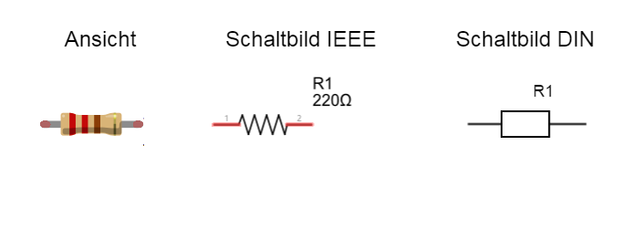
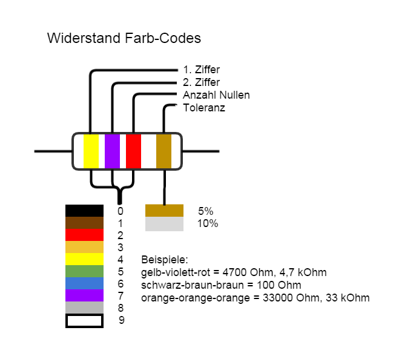
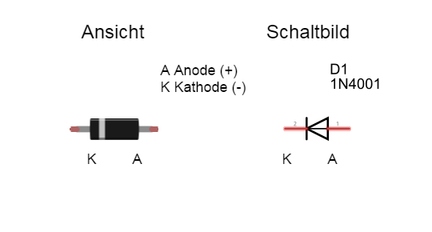
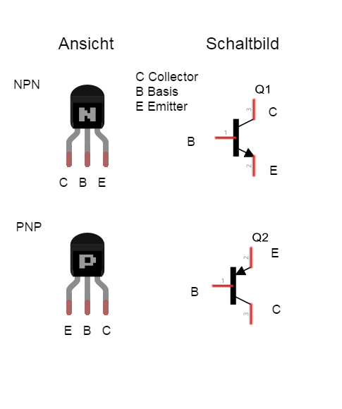
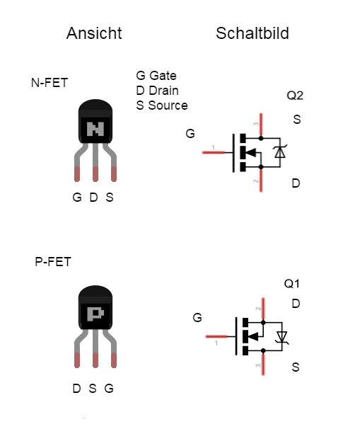
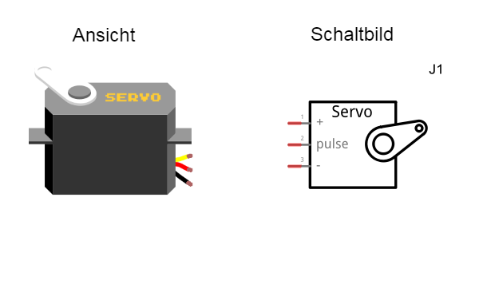
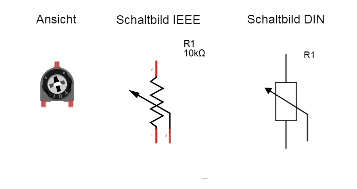
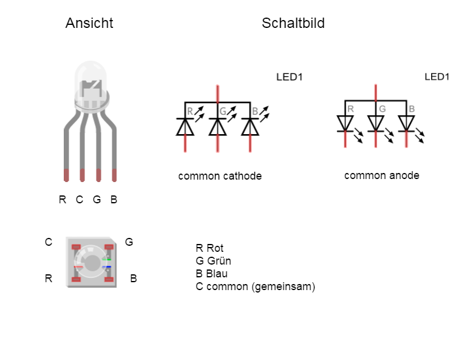
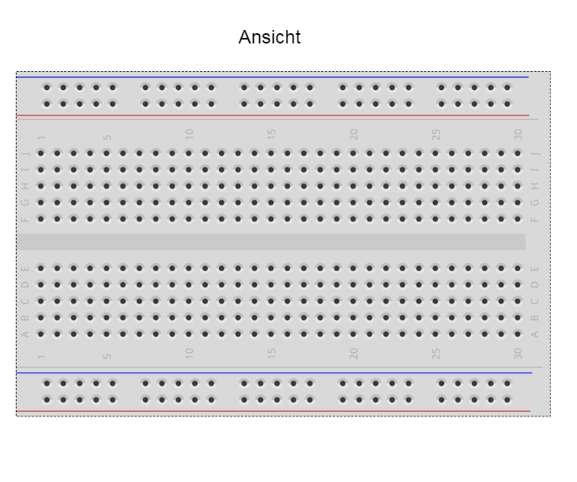

# Elektronik Einführung

Es wird keine Erfahrung mit elektronischen Bauteilen benötigt, um Spaß mit Arduino & Co zu haben. Die wichtigsten Informationen finden sich hier. Für weiterführende Infos empfehle ich das [Mikrocontroller.net](https://www.mikrocontroller.net/articles/Elektronik_Allgemein)
 

Für eine Einführung in Arduino ist ein Besuch der [Arduino Website](http://arduino.cc/en/Guide/HomePage) empfehlenswert.

## Widerstand
Ein Widerstand dem Strom einen Widerstand entgegensetzt. Eingesetzt werden Widerstände zur Strombegrenzung (Vorwiderstand bei LEDs) und als Spannungsteiler, um definierte Pegel einstellen (Pullup- und Pulldown-Widerstände).

### Was macht es:
Reduziert den Strom, der durch einen Stromkreis fließt.
### Anzahl Anschlüsse:
2 
### Identifizierung:
Zylindrisch mit Drahtenden an beiden Seiten. Der Widerstandswert wird über Farbringe auf dem Bauteil definiert. 

### Was zu beachten ist:
Man erwischt leicht den falschen Wert  (immer doppelt checken oder mit dem Multimeter nachmessen)
### Mehr Informationen:
[Wikipedia Widerstand](https://de.wikipedia.org/wiki/Widerstand)

## Diode

### Was macht es:
Die Diode ist ein Halbleiter, der den Strom nur in eine Richtung fliessen läßt. Wird auch als Gleichrichter bezeichnet. Das Schaltbild mit dem Pfeil kann man sich als Eselsbrücke merken, der Strom fliesst in Pfeilrichtung von der Anode (+) zur Kathode (-) (technische Stromrichtung)
### Anzahl Anschlüsse:
2 (Anode und Kathode. Zur Unterscheidung hat das Gehäuse einen Ring auf der Seite der Kathode)
der längere Pin 
### Identifizierung:
Üblicherweise ein Zylinder mit Drähten an beiden Enden. Ein Ring auf der Seite der Kathode zeigt die Polarität an.
### Was zu beachten ist:
Funktioniert nur in eine Richtung.
### Mehr Informationen:
[Wikipedia Diode](https://de.wikipedia.org/wiki/Diode)

## LED
Eine LED (Light Emitting Diode) auch Leuchtdiode genannt, ist eine Diode, die in Durchlassrichtung betrieben, Licht aussendet. In Gegenrichtung betrieben, sperrt die LED wie eine normale Diode und sendet kein Licht. Das Schaltbild mit dem Pfeil kann man sich als Eselsbrücke merken, der Strom fliesst in Pfeilrichtung von der Anode (+) zur Kathode (-) (technische Stromrichtung). Zum Betrieb einer LED ist immer ein Vorwiderstand notwendig. Die Größe des Vorwiderstandes (als Faustformel ca. 500 Ohm bei 5V) hängt ab:
* von der Durchlassspannung (abhängig von der Farbe, 1,6V für eine rote LED), 
* der Betriebsspannung (zum Beispiel 5V) 
* und dem max. Betriebsstrom (20mA) ab. Es gibt auch Low Current LEDs mit einem max. Gesamtstrom von 2mA.
Im Zweifel lieber einen höheren Widerstandswert nehmen.

### Was macht es:
Sendet Licht aus, wenn Strom in Durchlassrichtung fliesst.
### Anzahl Anschlüsse:
2 (der längere Anschluss, die Anode, geht an Plus. Der Kathoden Anschluss kann erfühlt werden, das LED Gehäuse ist an der Kathodenseite etwas abgeflacht )
### Identifizierung:
Sieht aus wie eine kleine Glühbirne.
### Was zu beachten ist:
* Funktioniert nur in eine Richtung
* benötigt einen Vorwiderstand zur Strombegrenzung

### Mehr Informationen:
[Wikipedia Leuchtdiode](https://de.wikipedia.org/wiki/Leuchtdiode)

## Transistor
Der Transistor ist ein Halbleiter mit zwei grundlegenden Eigenschaften. Zum einen kann der Transistor als elektronischer Schalter betrachtet werden. zum anderen kann der Transistor auch ein Signal verstärken. Ein kleiner Strom über die Basis-Emitter Strecke führt zu einem grossen Strom über die Kollektor-Emitter Strecke. Bei einem NPN-Transistor wird der Kollektor Es gibt neben NPN-Transistoren auch PNP-Transistoren mit umgekehrter Polarität.

### Was macht es:
Kann mit einem kleinen Basisstrom einen grossen Laststrom schalten, bzw. verstärken.
### Anzahl Anschlüsse:
3 (Basis, Kollektor, Emitter). Pinbelegung kann variieren. Deshalb vor dem Anschliessen unbedingt das Datenblatt lesen.
### Identifizierung:
Transistoren gibt es in vielen verschiedenen Gehäuseformen (TO92 und TO220 sind die gängigsten).
### Was zu beachten ist:
* Vorsicht, nicht verpolt anschliessen. 
* Es wird ein Widerstand zur Strombegrenzung am Basis Anschluss benötigt. 
* Beim Schalten induktiver Lasten wie Motoren und Relais zusätzlich eine Schutzdiode (In Gegenrichtung parpallel zum Motor, Relais geschaltet).
### Mehr Informationen:
[Wikipedia Transistor](https://de.wikipedia.org/wiki/Transistor)

## FET
Der FET (Feld-Effekt-Transistor) hat ähnliche Eigenschaften wie der Transistor. Wie beim normalen bipolaren Transistor gibt es zwei Typen, N-FET und P-FET. Der N-FET entspricht dem NPN-Transistor und der P-FET dem Gegenstück, dem PNP-Transistor. FETs sind im Gegensatz zu Transistoren spannungsgesteuert. Die Anschlüsse heissen Gate, Source und Drain mit äquivalente Funktionen des Transistors (Basis, Kollektor und Emitter). Im Gegensatz zum Transistor haben FETs einen kleineren Innenwiderstand. Dadurch ist der Wirkungsgrad besser als beim Transitor.

### Was macht es:
Kann mit einem kleinen Basisspannung eine grosse Lastspanung und auch Laststrom schalten, bzw. verstärken.
### Anzahl Anschlüsse:
3 (Gate, Source und Drain). Pinbelegung kann variieren. Deshalb vor dem Anschliessen unbedingt das Datenblatt lesen.
### Identifizierung:
Transistoren gibt es in vielen verschiedenen Gehäuseformen (TO92 und TO220 sind die gängigsten).
### Was zu beachten ist:
* Vorsicht, nicht verpolt anschliessen. 
* Es wird ein Widerstand zur Strombegrenzung am Gate Anschluss benötigt. 
* Empfehlenswert ist auch ein PullDown Widerstand an der Basis. Offene FET Eingänge neigen zum Schwingen und können das Bauteil zerstören. 
* Beim Schalten induktiver Lasten wie Motoren und Relais zusätzlich eine Schutzdiode (In Gegenrichtung parpallel zum Motor, Relais geschaltet).
### Mehr Informationen:
[Wikipedia Transistor](https://de.wikipedia.org/wiki/Feldeffekttransistor)

## DC Motor 
Der Gleichstrom Motor oder auch kurz DC-Motor genannt, wird über eine Gleichspannung angetrieben. Je höher die Spannung, desto schneller dreht sich die Achse des Motors. Polt man die Spannung um, dreht der Motor in die andere Richtung.  

### Was macht es:
Dreht sich, wenn genug Strom durch den Motor fließt.
### Anzahl Anschlüsse:
2 
### Identifizierung:
Üblicherweise ein Zylinder mit einer drehbaren Achse an einer Seite und 2 elektrischen Anschlüssen an der anderen Seite.
### Was zu beachten ist:
* Es wird ein geeigneter Transistor, FET oder Relais benötigt, der genug Leistung bringt um den Motor anzutreiben. 
* Nicht direkt an den Arduino Pins abnschliessen. 
* Soll auch die Drehrichtung gewechselt werden können ist eine H-Brücke notwendig.
* Ein DC-Motor kann unter Last locker ein paar Ampere Strom ziehen. Deshalb nicht über USB oder über den Arduino mit Strom versorgen, sondern eine eigene geeignete Stromversorgung verwenden
### Mehr Informationen:
[Wikipedia DC-Motor](https://de.wikipedia.org/wiki/Gleichstrommaschine)

## Servo
Ein Servo ist ein kleiner Gleichstrom Motor (DC-Motor), der zusammen mit der Ansteuer-Elektronik in einem Gehäuse sitzt. Angesteuert wird der Servo über einen zyklisch wiederholten Servo Impuls (alle 20ms ein 1..2ms HIGH Puls). Die Länge des Pulses ergibt die Position, die der Servo anfahren soll (1ms linker Anschlag 0°, 1.5ms Mitte 90°, 2ms rechter Anschlag 180°, bzw alle Werte dazwischen). Denn im Gegensatz zu einem DC-Motor verfügt der Servo nur über einen eingeschränkten Stellbereich (180°). Über ein Potentiometer erkennt die Motor-Elektronik, wo der Motor steht, und regelt automatisch die Position nach. 

### Was macht es:
Stellt das Servo Horn entsprechend der Länge eines Eingangs Impulses.
### Anzahl Anschlüsse:
3 (GND, VCC, Signal mit unterschiedlichen Draht Farben:
* GND schwarz oder braun, 
* VCC rot oder orange
* Signal weiss oder gelb
### Identifizierung:
Eine Plastik-Box mit 3 Anschluss Drähten mit einem drehbaren Servo Horn.
### Was zu beachten ist:
* Der Steckverbinder des Servos darf nicht verpolt angeschlossen werden. Drahtfarben beachten.
* Der Servo-Signal Pin kann direkt an an einem Controller wie z.B. einem  Arduino Pins angeschlossen werden. 
* Auch ein Servo kann unter Last locker mehr Strom ziehen, als der Controller liefern kann. Deshalb auch hier eine eigene geeignete Stromversorgung verwenden
### Mehr Informationen:
[Wikipedia Servo](https://de.wikipedia.org/wiki/Servo)

## Piezo Summer
Ein Piezo Summer ist ein kleiner Lautsprecher, der durch eine geeignete Frequenz zum Schwingen angeregt wird und einen hörbaren Ton erzeugt. 

### Was macht es:
Ein einzelner Puls erzeugt ein Klicken. Eine Folge von Pulsen erzeugt einen Ton
### Anzahl Anschlüsse:
2 
### Identifizierung:
Entweder ein kleiner Zylinder mit einem Loch an einer Seite und zwei Anschlüssen an der anderen. Andere Ausführungen bestehen aus einer Kupferfarben Scheibe mit Anschlussflächen oben und unten.
### Was zu beachten ist:
* Ein Transistor wird zur Ansteuerung empfohlen. 
* Kleine Summer können auch direkt an einem Controller wie z.B. einem Arduino betrieben werden  
### Mehr Informationen:
[Wikipedia Summer](https://de.wikipedia.org/wiki/Summer)

## Taster
Ein Taster schliesst einen Stromkreis, wenn man ihn drückt. 

### Was macht es:
Schliesst einen Stromkreis, wenn man ihn drückt. 
### Anzahl Anschlüsse:
2 oder 4 (bei 4 Anschlüssen sind je zwei Anschlüsse doppelt)
### Identifizierung:
Meist quadratrisch mit einem runden Druckknopf an der Oberseite und Anschlüssen an der Unterseite.
### Was zu beachten ist:
* Bei der 4-poligen Variante herausfinden, welche Pins zusammengeschlossen sind.
* Ein PullUp oder PullDown Widerstand ist sinnvoll
### Mehr Informationen:
[Wikipedia Taste](https://de.wikipedia.org/wiki/Taste)

## Potentiometer
Ein Potentiometer ist ein Widerstand mit einem veränderbaren Mittelabgriff. Entweder kann durch Drehen oder Schieben der Widerstand geändert werden. Der Gesamt Widerstand zwischen den äußeren Pins ändert sich natürlich nicht. 

### Was macht es:
Ein variabler Widerstand, meißtens änderbar mit einem Drehknopf.
### Anzahl Anschlüsse:
3 
### Identifizierung:
Es gibt Potis mit diversen Abmessungen und Bauarten. Hochkant oder liegend. Mit einer Achse oder nur mit einem Schraubendreher einstellbar 
### Was zu beachten ist:
Potis können eine lineare oder logarithmische Kennlinie haben
### Mehr Informationen:

[Wikipedia Potentiometer](https://de.wikipedia.org/wiki/Potentiometer)

## Fotowiderstand
Ein Fotowiderstand auch als LDR (Light Deended Resistor), also lichtabhängiger Widerstand, bezeichnet, ändert seinen Widerstand in Abhängigkeit von der Helligkeit. 

### Was macht es:
Ändert seinen Widerstand unter Lichteinfluss.
### Anzahl Anschlüsse:
2 
### Identifizierung:
Üblicherweise eine Scheibe mit 2 Anschlüssen. Die Oberseite ist klar und darunter ist eine Schicht mit einer wellenförmigen Linie zu sehen.
### Was zu beachten ist:
Ein Spannungsteiler ist notwendig um ein vernünftiges Signal zu bekommmen
### Mehr Informationen:
[Wikipedia Fotowiderstand](https://de.wikipedia.org/wiki/Fotowiderstand)

## Temperatur Sensor

### Was macht es:
Temperatur Sensoren gibt es in zwei Varianten.
Variante 1 ist passives Bauelemnt mit 2 Anschlüssen, ein variabler Widerstand, der sich mit der Temperatur ändert. Es gibt NTCs (negative temperature coefficient) und PTCs (negative temperature coefficient). Beim NTC wird der Widerstand kleiner mit steigender Temperatur, während beim PTC der Widerstand mit der Temperatur steigt. NTC und PTC haben eine nicht lineare Widerstandskennlinie die zur Temperatur Berechnung umgerechnet werden müssen.
Variante 2 sind integrierte Schaltkreise (IC), benötigen ein Stromversorgung und haben deshalb 3 Anschlüsse. Das Ausgangssiganl ist linear zur Temperatur. Während der LM35 bzw. TMP35 z.B. hat ein Ausgangssignal von 0mV bei 0°, 250mV bei 25°, und negative Spannungen bei Minusgraden ausgibt, besitzt der TMP36 einen Offset von 500mV um auch negative Spannungen mit positiver Spannung anzeigen zu können. 

### Anzahl Anschlüsse:
2 oder 3 (GND, Signal, 5V)
### Identifizierung:
TMP35,36 im TO92 Gehäuse mit entsprechendem Aufruck
### Was zu beachten ist:
Datenblatt beachten
### Mehr Informationen:
[Wikipedia Temperatursensor](https://de.wikipedia.org/wiki/Temperatursensor)

## RGB LED
Bei einer RGB LED sitzen drei LEDs in den Farben rot grün und blau in einem Gehäuse. Durch unterschiedliche Spannungen lassen sich neben den Grundfaben praktisch auch alle Mischfarben erzeugen.  

### Was macht es:
Drei LEDs in den Farben rot grün und blau in einem Gehäuse
### Anzahl Anschlüsse:
4 oder 6 (4 Anschlüsse bei geeinsamer Anode oder Kathode, 6 Anschlüsse bei einzeln herausgeführten LEDs
### Identifizierung:
Sieht aus wie eine normale LED, hat aber mehr Anschlüsse.
### Was zu beachten ist:
Die 4poligen RGB LEDS gibt es in zwei Varianten. Gemeinsame Anode oder gemeinsame Kathode.
Es gibt 2 gängige Bauarten von RGB LEDs. Bulb (Normale LED Form, 2. Pin ist länger und ist der gemeinsame Pin) oder Piranha bzw SuperFlux (quadratisches Gehause mit einer abgeschrägten Ecke und diversen Verdrahtungs Varianten)
Jede Einzel LED braucht einen eigenen Vorwiderstand. 
Die Vorwiderstände sind unterschiedlich, entsprechend der Durchlassspannung.
### Mehr Informationen:
[Wikipedia Leuchtdiode](https://de.wikipedia.org/wiki/Leuchtdiode)

## Steckplatine
Ein Steckplatine dient zum lötfreien Probe-Aufbau von Schaltungen. Es gibt Steckplatinen in verschiedenen Abmessungen 

### Was macht es:
Probeaufbau von Schaltungen
### Was zu beachten ist:
Die Löcher der inneren Spalten sind vertikal miteinander verbunden. Die äußeren Reihen horizontal. Bei größeren Steckplatinen können die aüßeren Reihen auch noch einmal unterbrochen sein (Farbmarkierung beachten).
### Mehr Informationen:
[Wikipedia Steckplatine](https://de.wikipedia.org/wiki/Steckplatine)

