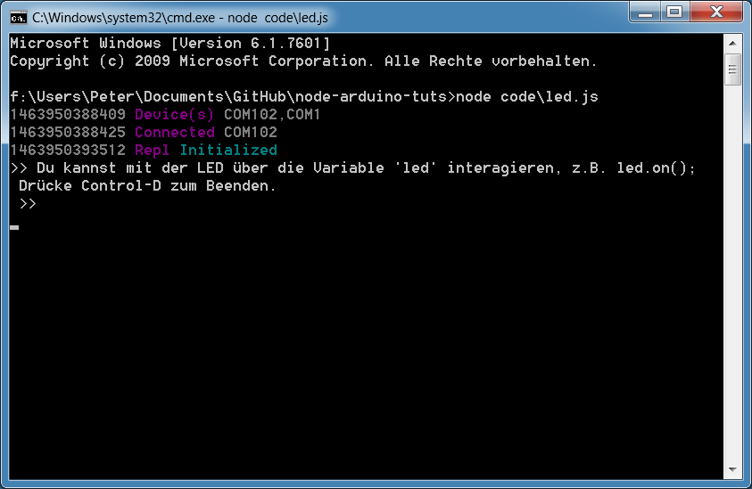

# NodeBots Einführung

NodeBots sind Roboter, die mit JavaScript programmiert werden.  Die Basis für NodeBots bilden [node.js](http://nodejs.org/) und die [Johnny-Five.js](http://johnny-five.io/) Bibliothek von Rick Walden.


 
`JavaScript + Hardware = Roboter`

Das ist die einfache Formel für das [NodeBots](http://nodebots.io/) Prinzip.

Dieses Tutorial führt Schritt für Schritt durch den Zusammenbau und die Programmierung von NodeBots mit Arduino-kompatibler Hardware. Vornehmlich wird der Arduino Micro verwendet. Es geht aber auch mit anderen Arduino Boards wie dem Uno, Mini, Nano oder Mega. Die [Liste der unterstützten Boards](http://johnny-five.io/platform-support/) ist sehr lang. 

Das Ziel des Tutorials ist der Spaß an der Sache. Nebenbei lernt man eine Menge über Elektronik, elektronische Schaltungen und natürlich die Programmierung mit JavaScript. Besondere Vorkenntnisse sind nicht notwendig.
 
### Woraus besteht ein NodeBot?

NodeBots lassen sich sehr günstig selbst herstellen. Die einfachste Variante besteht aus Pappe, 2 Servos mit Endlosantrieb und einem Arduino Board mit Bluetooth Modul. 

Da JavaScript nicht auf dem Arduino selbst läuft, ist für die Steuerung ein PC notwendig auf dem Linux, MacOS oder Windows läuft (auch ein Raspberry Pi ist dafür geeignet). Auf dem Arduino selbst, läuft nur das [Firmata](http://www.firmata.org/wiki/Main_Page) Sketch.

Firmata ermöglicht die Ansteuerung der Arduino Hardware (digitale und analoge Ein-Ausgänge, PWM, I2C, OneWire etc) über die serielle Schnitttelle

Für einen mobilen autonomen Roboter ist es notwendig, das entweder der PC (Raspberry Pi) mit auf dem Roboter sitzt, oder der Roboter über eine drahtlose serielle Schnittstelle (Bluetooth) verfügt. Wenn man einen Rapsberry Pi verwendet, kann man auch auf das Arduino Board verzichten und direkt die GPIOs des Raspberry Pi zum Ansteuern der Hardware verwenden. Dazu wird die Bibliothek [Raspi-IO](https://github.com/nebrius/raspi-io/) benötigt.

### Installation

Das Tutorial kann auf dem eigenen Computer installiert und offline ausgeführt werden. Dazu wird [Node.js](https://nodejs.org/) benötigt. Zunächst installiert man nur das aktuelle Node.js für sein OS. Weitere benötigte Bibliotheken können über den Node Paket Manager `npm` installiert werden.

Um das Tutorial zu installieren, öffne die `Node.js command prompt` und gib folgende Kommandos ein:

Unter Linux/Mac:

```
git clone https://github.com/RobotFreak/NodeBots-Tutorial.git
cd ./NodeBots-Tutorial
npm install
```
Unter Windows das [NodeBots-Tutorial Archiv](https://github.com/robotfreak/NodeBots-Tutorial) von Github herunterladen und entpacken. Dann eine Eingabeaufforderung öffnen und folgende Befehle eingeben: 

```
cd <Install-Path>\NodeBots-Tutorial
npm install
```

Starte das Tutorial aus dem `NodeBots-Tutorial` Vereichnis, mit:

```
npm start
```

Öffne die URL [http://localhost:3000](http://localhost:3000) im Web Browser um das Tutorial zu starten.


## Johnny-Five

Das Tutorial werwendet die [Johnny-Five](https://npmjs.org/package/johnny-five) Bibliothek für `node.js` um NodeBots zu programmieren. Johnny-Five benutzt das Protokoll  [Firmata](http://firmata.org/wiki/Main_Page) um mit Arduino-kompatibler Hardware über USB (Universal Serial Bus) zu komnunizieren. Johnny-Five und alle anderen notwendigen Bibliotheken werden bei der Installation des Tutorials bereits mitinstalliert.

### Installation von Firmata

Bevor es mit der Programmierung von NodeBots losgehen kann, muss noch das Firmata Sketch auf das Arduino-Board geladen werden:

* Downloade die [Arduino IDE](http://arduino.cc/en/main/software)
* Verbinde das Arduino-Board über USB mit dem PC
* Öffne die Arduino IDE und wähle das Firmata Sketch aus: `Datei > Beispiele > Firmata > StandardFirmataPlus`
* Wähle den richtigen Arduino Board Typ aus (z.B. Arduino Micro): `Werkzeuge > Board`
* Wähle den richtigen Port für dein board aus: `Werkzeuge > Port > (den Comm Port des Arduino Boards)`
* Lade das Sketch auf das Arduino Board mit: `Sketch > Hochladen`


### Ausführen eines Johnny-Five Programmes

Die Johnny-Five Bibliothek wird bereits zusammen mit diesem Tutorial installiert. Jedes Beispiel innerhalb des `NodeBots-Tutorial` Verzeichnis wird sofort funktionieren.
Wenn Programme auch aus einem anderen Verzeichnissen geladen werden sollen, sollte die Johnny-Five besser global für alle Verzeichnisse mit dem Parameter `-g` installiert werden:

```
npm install johnny-five -g
```

Um ein Beispiele aus dem `NodeBots-Tutorial` Verzeichnis zu starten, verbinde das Arduino Board über USB mit dem PC und gebe
unter Linux/Mac ein:

```
node ./code/led.js
```

unter Windows ein:

```
node code\led.js
```



### Benutzung von REPL

Johnny-Five stellt eine sogennante Read-Eval-Print-Loop (REPL) zur Verfügung. Damit können JavaScript Kommandos interaktiv ausgeführt werden, während das Programm läuft. Näheres dazu findet man in den Beispielen.

## Open Source Hardware

Dieses Tutorial basiert auf `node-ardx`von [Anna Gerber](https://github.com/AnnaGerber) und der SparkFun Version von .:oomlout:.'s ARDX (Arduino Experimenter's) Guide.

Alle Projekte von .:oomlout:. sind open source. Was bedeutet das? Es bedeutet, das sämtliches Material wie das ARDX kit, inkludsive dieser Tutorials, Schaltpläne und Programm Code frei zum Download verfügbar sind. Aber es geht noch weiter: Es steht ihnen frei das Material zu kopieren und zu verändern und selbst zu veröffentlichen. Das ist möglich, weil dieses Tutorial unter einer Creative Commons (CC-BY-SA) Lizenz steht. Wenn sie dieses Tutorial verändern und veröffentlichen, müssen die Autoren sowie SparkFun und .:oomlout: erwähnt wedden.

Mehr Informationen über die [Creative Commons CC (By Share Alike)](http://creativecommons.org/licenses/by-sa/3.0/) Lizenz 

## Lizenz

Das komplette Projekt ist auf [Github](https://github.com/RobotFreak/NodeBots-Tutorial) verfügbar  

Die Progamm Beispiele stehen unter der MIT Lizenz

Dieses Arbeit ist lizensiert unter der [Creative Commons Attribution-Share Alike 3.0 Lizenz](http://creativecommons.org/licenses/by-sa/3.0/)
