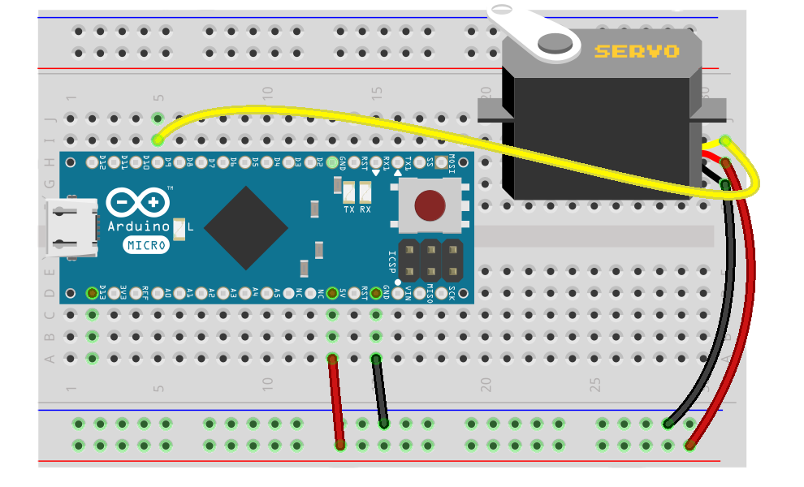

# Roboter Antriebe

Damit sich ein Roboter fortbewegen kann, benötigt er einen Antrieb, einen Motor. Ein Roboter mit Armen oder einem Kopf, sollte diesen auch bewegen können. Dafür gibt es Servos.

## Tutorials

* [Motor](exercises/motor.md)
* [2-fach Motor Treiber](exercises/dual-motor.md)
* [Servo](exercises/servo.md)
* [Roboterkopf mit Pan/Tilt Servos](exercises/servo-pan-tilt.md)

## Weiterführende Themen

Damit der Roboter auch auf Ereignisse von außen mit bestimmten Verhaltensweisen reagieren kann, fehlen dem Roboter noch die nötigen Sinne, sprich die Sensoren, um seine Umwelt wahrzunehmen. Näheres dazu lernt man im Kapitel über [Roboter Sensoren](sensors.md). 

Weiterhin wäre es schön, wenn der Roboter Anzeigen hätte, mit denen er . Näheres dazu lernt man im Kapitel über [Roboter Anzeigen](displays.md). 

Alles zusammen ergibt erst einen kompletten Roborer. Im Kapitel [komplette Roboter](robots.md) werden einige Beispiele vorgestellt.

