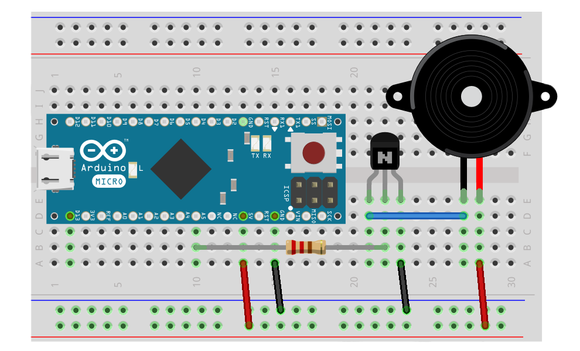

# Roboter Anzeigen

Damit sich der Roboter bemerkbar machen kann, falls er ein Problem hat, sind Anzeigen ein ganz wichtiges Thema. Darum geht es in diesem Teil des Robotik Tutorials.

## Tutorials

* [LED-Matrix](exercises/led-matrix.md "LED-Matrix")
* [7-Segment Anzeige](exercises/7-segment.md "7-Segment Anzeige")
* [Roboter Gesicht aus LED-Matrizen](exercises/multi-led-matrix.md "Roboter Gesicht aus LED-Matrizen")
* [Piezo Lautsprecher](exercises/piezo.md "Piezo Lautsprecher")

## Weiterführende Themen

Leider ist der Roboter Kopf noch etwas starr. es wäre schön, wenn er auch seinen Kopf auch bewegen könnte. Damit kann der Kopf des Roboters vorprogrammierte Bewegungen durchführen. Servos lernen wir im Tutorial über [Roboter Antriebe](actors.md) kennen.
 
Damit der Roboter auch auf Ereignisse von außen mit bestimmten Verhaltensweisen reagieren kann, fehlen dem Roboter noch die nötigen Sinne, sprich die Sensoren, um seine Umwelt wahrzunehmen. Näheres dazu lernt man im Kapitel über [Roboter Sensoren](sensors.md). 

Alles zusammen ergibt erst einen kompletten Roborer. Im Kapitel [komplette Roboter](robots.md) werden einige Beispiele vorgestellt.

