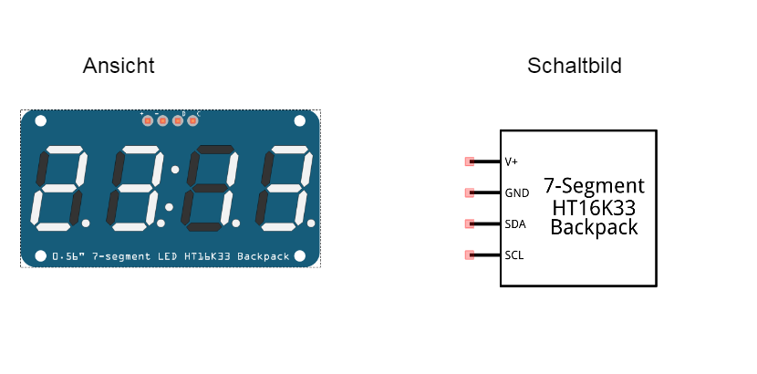
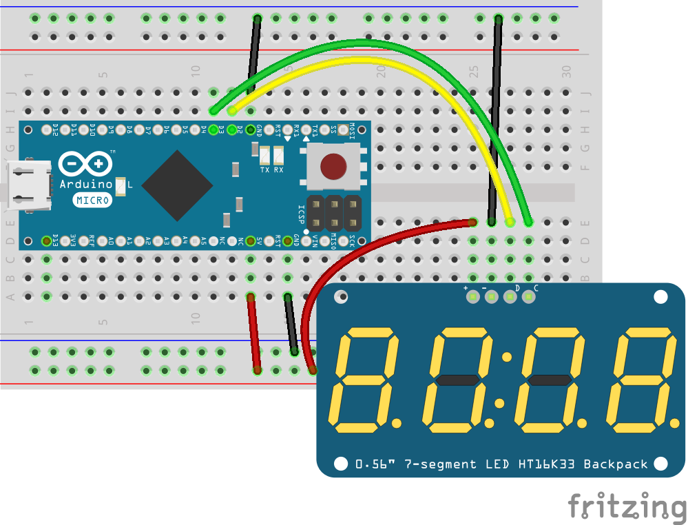
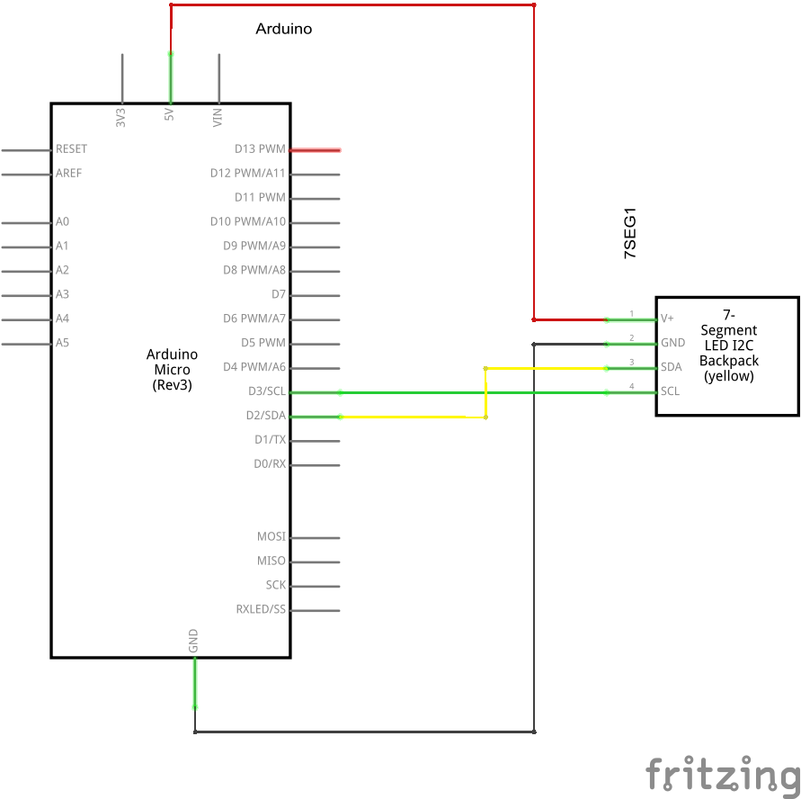

## 7-Segment Anzeige

Eine Sonderform der LED-Matrix ist die 7-Segment Anzeige. Mit den 7 LEDs können die Ziffern 0..9 und auch einige Buchstaben dargestellt werden. Das ist einefeine Sache um z.B. den Wert eines Sensors oder einfach die aktuelle Uhrzeit anzuzeigen. Die Ansteuerung erfolgt identisch zur LED Matrix über I2C.




### Schaltung





### Programm

Das Programm stellt eine Uhr auf der 7-Segment Anzeige dar.
Es wird unter Linux mit `node ./code/led-digits-clock-HT16K33.js` unter Windows mit `node code\led-digits-clock-HT16K33.js` gestartet.

Drücke `Control-D` um das Program zu beenden.

```javascript
var moment = require("moment");
var five = require("johnny-five");
var board = new five.Board({
});

board.on("ready", function() {
  var digits = new five.Led.Digits({
    controller: "HT16K33",
  });
  var toggle = 0;

  setInterval(function() {
    // Toggle the colon part: on for a second, off for a second.
    digits.print(time(toggle ^= 1));
  }, 1000);
});

function time(showColon) {
  var display = "    " + moment().format(
    showColon ? "h:mm" : "h mm"
  );
  return display.slice(-5);
}

```

### Weitere Informationen

* [Johnny-Five LED Digits Uhr Beispiel](http://johnny-five.io/examples/led-digits-clock-HT16K33/)
* [Johnny-Five LED.Digits API](http://johnny-five.io/api/led.digits/)

