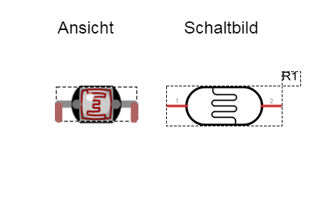
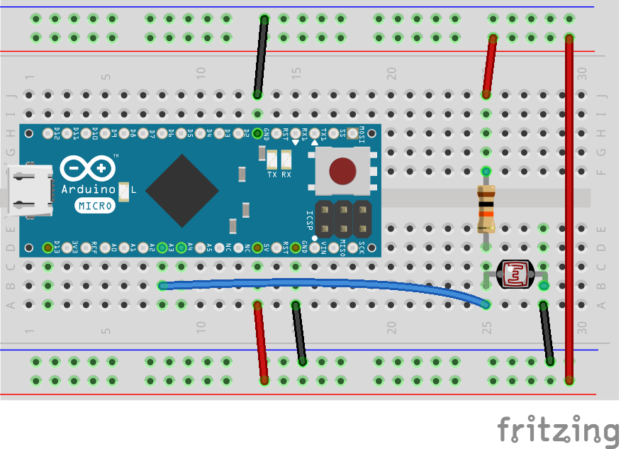
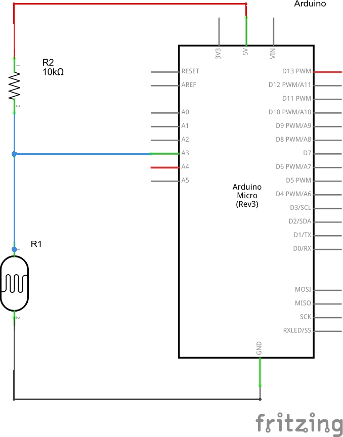

## Licht-Sensor 

Der erste Sensor, den wir kennenlernen werden ist ein Licht-Sensor. Der Licht-Sensor ist ein Bauteil, dessen elektrischer Widerstand sich mit der Helligkeit des eintreffenden Lichts ändert. Der Mikrocontroller auf dem Roboter kann den Widerstand indirekt über die Spannung  messen, die am Widerstand abfällt. Ändert sich der Widerstand, so ändert sich auch die Spannung (gemäß dem Ohmschen Gesetz). Um die Spannung messen zu können, verfügt der Mikrocontroller über analoge Eingänge. Die Spannung, die am analogen Eingang anliegt (im Bereich 0..5V) wird in einen äquivalenten Digitalwert umgerechnet und kann so vom Mikrocontroller verarbeitet werden.



Für einen Roboter mit Licht-Sensor(en) können zwei Verhalten programmiert werden. Zm einen die “Motte”, die ja bekanntlich eine Lichtquelle umkreist, weil sie denkt es sei der Mond. Zum anderen die “Kakerlake”, die im Gegensatz zur Motte das Licht meidet und lieber ein schattiges Plätzchen bevorzugt.  

### Schaltung





### Programm

Das Programm gibt den Wert des Sensors im Terminal (und optional auf der 7-Segment Anzeige) aus. Es wird gestartet

unter Linux mit: 

```
node ./code/ldr-sensor.js
```

unter Windows mit:

```
node code\ldr-sensor.js
```

```javascript
var five = require("johnny-five"),
  board, photoresistor;

board = new five.Board();

board.on("ready", function() {

  // Create a new `photoresistor` hardware instance.
  var light = new five.Sensor({
    pin: "A3",
  });

  light.on("change", function() {
    var lightval = five.Fn.scale(this.value, 1023, 0, 0, 100);
    console.log("Lichtwert: ");
    console.log("  val : ", lightval);
    console.log("-----------------");
  });
});
```

### Übungen

Lege deine Hand über den Licht-Sensor um so das einfallende Licht abzuschatten. Beobachte dazu die ausgegebenen Werte im Terminal.

## Mehr Informationen

* [Johnny-Five Sensor Beispiele](http://johnny-five.io/examples/sensor/)
* [Johnny-Five Sensor API](http://johnny-five.io/api/sensor)
* [Johnny-Five LDR Beispiele](http://johnny-five.io/examples/photoresistor/)
