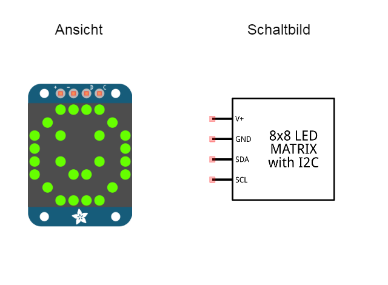

## LED Matrix

Eine LED Matrix besteht aus mehreren LEDs die üblicherweise in Form einer Matrix von z.B. 8x8 LEDs angeordnet sind. Damit lassen sich gegenüber einer einzelnen LED noch mehr Informationen darstellen. Neben Zahlen und Buchstaben sind damit auch kleine Grafiken wie Emojis möglich. Allerdings ist es nicht ohne weiteres möglich, die 8x8 (64)  LEDs direkt  mit einem Mikrocontroller wie dem Arduino anzusteuern. Zum einen wegen der Stromaufnahme zum anderen wegen der schieren Anzahl von Anschluss Pins die dazu notwendig wären. Deshalb verfügen  LED-Matrizen über Schieberegister oder Port Erweiterungen um Anschluss Pins zu sparen. Die Adafruit LED Matrix 8x8 verfügen über ein I2C interface. Dafür werden nur 2 Pins benötigt. Mehrere Matrizen lassen sich parallel betreiben, da I2C ein serieller Bus ist.



Für eine 8x8 Matrix werden insgesamt 64 Informationen benötigt, ob die entsprechend eLED an oder ausgeschaltet werden soll. Das sind 8 Bytes, je darzustellendes Zeichen Je 8 Bits pro Zeile bei insgesamt 8 Zeilen. Eigene Zeichen lassen sich recht einfach selbst erzeugen, wenn man im Programm die Binär Schreibweise für die 8 Zeilen wählt.

So sieht z.B. die Darstellung auf der LED-Matrix für einen Smiley aus:`


Und so der entsprechende Abschnitt im Programm:

```javascript
  var smile[
    "00000000",
    "01100110",
    "01100110",
    "00000000",
    "00000000",
    "10000001",
    "01000010",
    "00111100"
  ];
```
### Teileliste

* Arduino Micro
* Steckplatine
* Drahtbrücken Set
* Adafruit 8x8 LED Matrix mit I2C Backpack

### Schaltung


### Programm

Das Programm gibt ein Herz Symbol auf der LED-Matrix aus. Es wird unter Linux mit `node ./code/led-matrix-HT16K33.js`, unter Windows mit `node code\led-matrix-HT16K33.js` gestartet.

```javascript
var five = require("johnny-five");
var board = new five.Board();

board.on("ready", function() {

  var heart = [
    "01100110",
    "10011001",
    "10000001",
    "10000001",
    "01000010",
    "00100100",
    "00011000",
    "00000000"
  ];

   var matrix = new five.Led.Matrix({
    addresses: [0x70],
    controller: "HT16K33",
  });

  matrix.clear();
  matrix.draw(heart);

  // type `draw("shape_name")` into the repl to see the shape!  
  this.repl.inject({
    matrix: matrix,
    draw: function(shape) {
      matrix.draw(five.Led.Matrix.CHARS[shape]);
    }
  });
});
```

### Übungen

Du kannst die LED-Matrix auch über das Terminal Fenster steuern. 

Probiere die Funktion `draw` mit verschiedenen Buchstaben, Zahlen und Sonderzeichen aus (z.B. `draw("$").für das Dollar-Zeichen. Es gibt auch einige Emojis, wie z.B. `draw("smile")` oder `draw("angryface")` 

### Weiterführende Links

* [Johnny-Five LED.Matrix API](http://johnny-five.io/api/led.matrix/)
