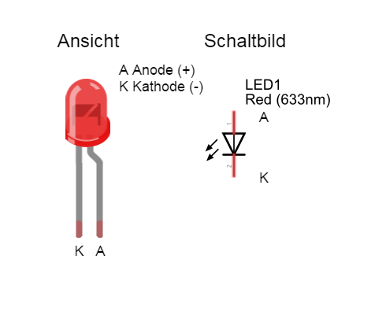

## LED

Das einfachste Arduino Programm, in Anlehnung an das einfachste C Programm 'Hallo Welt', wird 'Hallo Arduino' genannt. Dabei wird eine LED (light emitting diode) zum Blinken gebracht.
Eine LED ist wohl die einfachste Form der Anzeige. Sie kann z.B. als Status Anzeige dienen. 



### Teileliste

* Arduino Micro
* Steckplatine
* Drahtbrücken Set
* 5mm LED 
* 680 Ohm Widerstand (blau-grau-braun)


### Schaltung

Zum Betrieb einer LED ist immer ein Widerstand notwendig, der in Reihe zur LED geschaltet wird. Es wird lediglich ein PWM-fähiger Pin benötigt, damit auch die Helligkeit der LED geändert werden kann. Beim Arduino Micro ist im Gegensatz zum Arduino Uno auch Pin 13 PWM fähig, ebenso wie Pin 11, 10, 9, 6, 5 und 3.


### Programm

Das Programm läßt die LED im Sekundentakt blinken. Es wird unter Linux mit `node ./code/led-pwm.js` unter Windows mit `node code\led-pwm.js` gestartet.

[gimmick:gist](543e8db970995df1171c984dc538e9a5)

Drücke `Control-D` um das Programm zu beenden.


```javascript
var five = require("johnny-five"),
    button, led;

five.Board().on("ready", function() {

  led = new five.Led(13);

  led.strobe( 1000 );

  // make myLED available as "led" in REPL

  this.repl.inject({
  	led: led
  });
	  
  // try "on", "off", "toggle", "strobe", "stop" (stops strobing)
});
```


### Übungen

Du kannst die LED auch über das Terminal Fenster steuern. 

Probiere folgende Parameter für die Funktion `led` aus (z.B. `led.pulse`). Einige Funktionen erwarten auch einen Parameter, wie z.B. `led.fadeIn(500)`

```
  "on", "off", "toggle", "brightness",
  "fade", "fadeIn", "fadeOut",
  "pulse", "strobe",
```

Zum Beenden einer Animation wie `strobe, pulse oder fade` gib `led.stop` ein

### Mehr Informationen

* [Johnny-Five LED Beispiele](http://johnny-five.io/examples/led/)
* [Johnny-Five LED API](http://johnny-five.io/api/led)


