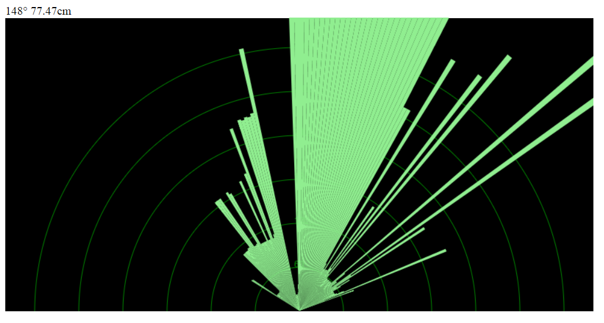
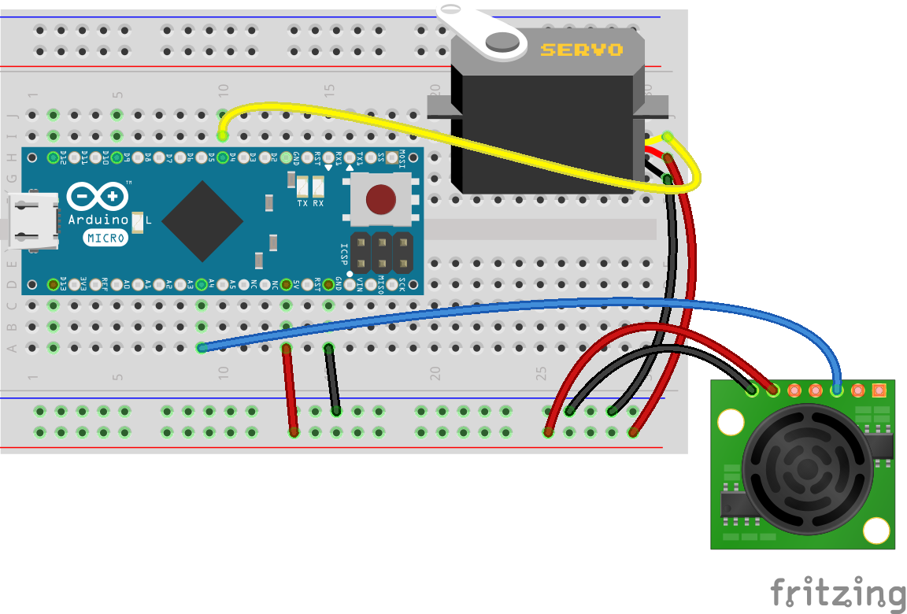

## Ultraschall Radar

Dieses Beispiel stellt die Daten eines Ultraschall Sensors, der mit einem Servo geschwenkt wird, grafisch in einer Art Radar-Ansicht dar.   



### Was wird benötigt

* Ultraschallsensor, siehe [Ultraschallsensor](ultrasonic.md)
* Servo und Pan/Tilt Kopf, siehe [Roboter Kopf mit Servo Pan Tilt](servo-pan-tilt.md)

### Schaltplan



### Programm

Das Programm verwendet den Browser zur Darstellung der Radar Bildes. Öffne dazu ein Browser-Fenster mit der Adresse `http://localhost:9000` und starte dann das Programm unter Linux mit `node ./code/radar.js`, unter Windows mit `node code\radar.js`

```javascript
var five = require("johnny-five"),
  child = require("child_process"),
  http = require("http"),
  socket = require("socket.io"),
  fs = require("fs"),
  app, board, io;

function handler(req, res) {
  var path = __dirname;

  if (req.url === "/") {
    path += "/radar.html";
  } else {
    path += req.url;
  }

  fs.readFile(path, function(err, data) {
    if (err) {
      res.writeHead(500);
      return res.end("Error loading " + path);
    }

    res.writeHead(200);
    res.end(data);
  });
}

app = http.createServer(handler);
app.listen(8080);

io = socket.listen(app);
io.set("log level", 1);

board = new five.Board();

board.on("ready", function() {
  var center, degrees, step, facing, range, scanner, soi, ping, last;


  // Open Radar view
  child.exec("open http://localhost:9000/");

  // Starting scanner scanning position (degrees)
  degrees = 21;

  // Servo scanning steps (degrees)
  step = 1;

  // Current facing direction
  facing = "";

  last = 0;

  // Scanning range (degrees)
  range = [20, 160];

  // Servo center point (degrees)
  center = range[1] / 2;

  // ping instance (distance detection)
  ping = new five.Proximity({
    controller: "MB1000",
    pin: "A4",
    freq: "100"
  });

  // Servo instance (panning)
  scanner = new five.Servo({
    pin: 4,
    range: range
  });

  this.repl.inject({
    scanner: scanner
  });

  // Initialize the scanner servo at 0°
  scanner.min();

  // Scanner/Panning loop
  this.loop(100, function() {
    var bounds, isOver, isUnder;

    bounds = {
      left: center + 5,
      right: center - 5
    };

    isOver = degrees > scanner.range[1];
    isUnder = degrees <= scanner.range[0];

    // Calculate the next step position
    if (isOver || isUnder) {
      if (isOver) {
        io.sockets.emit("reset");
        degrees = 20;
        step = 1;
        last = -1;
      } else {
        step *= -1;
      }
    }

    // Update the position by N° step
    degrees += step;

    // Update servo position
    scanner.to(degrees);
  });

  io.sockets.on("connection", function(socket) {
    console.log("Socket Connected");

    soi = socket;

    ping.on("data", function() {

      if (last !== degrees) {
        io.sockets.emit("ping", {
          degrees: degrees,
          distance: this.cm
        });
      }

      last = degrees;
    });
  });
});
```

Neben dem `radar.js` wird natürlich auch eine HTML Seite benötigt, `radar.html´:

```
<!DOCTYPE html>
<html>
<head>
  <meta charset=utf-8 />
  <title>Radar</title>
  <script src="/jquery-git.js"></script>
  <script src="/socket.io/socket.io.js"></script>
</head>
<body>
  <div>
    <span id="degrees"></span>
    <span id="distance"></span>
  </div>
  <canvas id="canvas" width="800" height="400" style="position:relative;z-index:10">
  </canvas>
  <script src="/radar-client.js"></script>
</html>
```

Des weiteren wird das ```radar-client.js``` benötigt. Dieses Programm bildet das Frontend, zeichnet das Radarbild und übernimmt die Sensordaten:

```javascript
(function(exports, io) {

  // private: `radars` cache array for storing instances of Radar,

  var socket, radars, colors, addl;

  socket = io.connect("http://localhost:9000");
  radars = [];
  colors = {
    // Color Constants
    yellow: "255, 255, 0",

    red: "255, 0, 0",

    green: "0, 199, 59",

    gray: "182, 184, 186"
  };
  addl = {
    distance: "cm",
    degrees: "°"
  };

  socket.on("ping", function(data) {
    if (radars.length) {
      radars[0].ping(data.degrees, data.distance);


      // TODO: This is bas
      Object.keys(data).forEach(function(key) {
        var node = document.querySelector("#" + key);

        if (node !== null) {
          node.innerHTML = data[key] + addl[key];

          if (node.dataset.moved === undefined) {
            node.style.top = radars[0].height + "px";
            node.style.position = "relative";
            node.dataset.moved = true;
          }
        }
      });
    }
  });

  socket.on("reset", function() {
    console.log("RESET");

    radars.length = 0;
    new Radar("#canvas");
  });


  // Radar Constructor

  function Radar(selector, opts) {
    var node, k;

    if (!(this instanceof Radar)) {
      return new Radar(selector);
    }

    node = document.querySelector(selector);

    if (node === null) {
      throw new Error("Missing canvas");
    }

    opts = opts || {};

    this.direction = opts.direction || "forward";

    // Assign a context to this radar, from the cache of contexts
    this.ctx = node.getContext("2d");

    // Clear the canvas
    this.ctx.clearRect(0, 0, node.width, node.height);

    // Store canvas width as diameter of arc
    this.diameter = this.ctx.width;

    // Calculate this radar's radius - is used in arc drawing arguments
    this.radius = this.diameter / 2;

    // Initialize step array
    this.steps = [Math.PI];

    // Calculate number of steps in sweep
    this.step = Math.PI / 180;

    // Fill in step start radians
    for (k = 1; k < 180; k++) {
      this.steps.push(this.steps[k - 1] + this.step);
    }

    // Set last seen angle to 0
    this.last = 0;

    // Draw the "grid"
    this.grid();

    radars.push(this);
  }

  Radar.prototype = {

    draw: function(distance, start, end) {

      var x, y;

      x = this.ctx.canvas.width;
      y = this.ctx.canvas.height;


      this.ctx.beginPath();
      this.ctx.arc(
        x / 2,
        y,
        distance / 2,
        start,
        end,
        false
      );

      // Set color of arc line
      this.ctx.strokeStyle = "lightgreen";
      this.ctx.lineWidth = distance;

      // Commit the line and close the path
      this.ctx.stroke();
      this.ctx.closePath();

      return this;
    },

    ping: function(azimuth, distance) {

      distance = Math.round(distance);


      // If facing forward, invert the azimuth value, as it
      // is actually moving 0-180, left-to-right
      if (this.direction === "forward") {
        azimuth = Math.abs(azimuth - 180);

        // Normalize display from mid sweep, forward
        if (this.last === 0 && azimuth < 175) {
          this.last = this.steps[azimuth + 1];
        }

        this.draw(distance, this.steps[azimuth], this.last);
      } else {

        // Normalize display from mid sweep, backward
        if (this.last === 0 && azimuth > 5) {
          this.last = this.steps[azimuth - 1];
        }

        this.draw(distance, this.last, this.steps[azimuth]);
      }


      this.last = this.steps[azimuth];

      return this;
    },

    grid: function() {

      var ctx, line, i,
        grid = document.createElement("canvas"),
        gridNode = document.querySelector("#radar_grid"),
        dims = {
          width: null,
          height: null
        },
        canvas = this.ctx.canvas,
        radarDist = 0,
        upper = 340;


      if (gridNode === null) {
        grid.id = "radar_grid";
        // Setup position of grid overlay
        grid.style.position = "relative";
        grid.style.top = "-" + (canvas.height + 3) + "px";
        grid.style.zIndex = "9";


        // Setup size of grid overlay
        grid.width = canvas.width;
        grid.height = canvas.height;

        // Insert into DOM, directly following canvas to overlay
        canvas.parentNode.insertBefore(grid, canvas.nextSibling);

        // Capture grid overlay canvas context
        ctx = grid.getContext("2d");


        ctx.fillStyle = "black";
        ctx.fillRect(0, 0, grid.width, grid.height);
        ctx.closePath();

        ctx.font = "bold 12px Helvetica";

        ctx.strokeStyle = "green";
        ctx.fillStyle = "green";
        ctx.lineWidth = 1;

        for (i = 0; i <= 6; i++) {

          ctx.beginPath();
          ctx.arc(
            grid.width / 2,
            grid.height,

            60 * i,

            Math.PI * 2, 0,
            true
          );

          if (i < 6) {
            ctx.fillText(
              radarDist + 60,
              grid.width / 2 - 7,
              upper
            );
          }

          ctx.stroke();
          ctx.closePath();
          upper -= 60;
          radarDist += 60;
        }
      }

      return this;
    }
  };


  // `radars` cache array access
  Radar.get = function(index) {
    return index !== undefined && radars[index];
  };

  // Expose Radar API
  exports.Radar = Radar;

}(this, this.io));


document.addEventListener("DOMContentLoaded", function() {
  new Radar("#canvas", {
    /**
     * direction
     *   forward  (facing away from controller)
     *   backward (facing controller)
     *
     * Defaults to "forward"
     *
     * @type {Object}
     */

    // direction: "forward"
  });
}, false);
```
