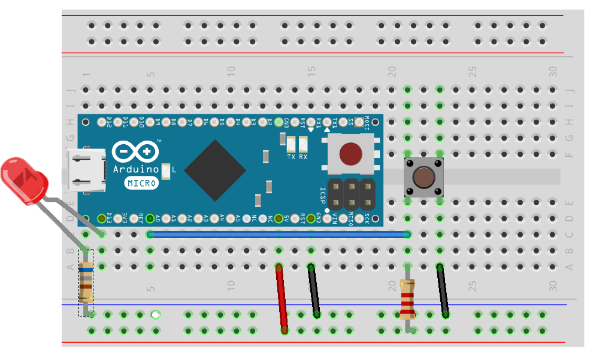

# Ein-Ausgabe Tutorial

Die Basics der NodeBots Programmierung werden hier behandelt.

## Tutorials

* [LED](exercises/led.md)
* [Taster](exercises/button.md)
* [Tastatur](exercises/keypad.md)
* [Potentiometer](exercises/poti.md)
